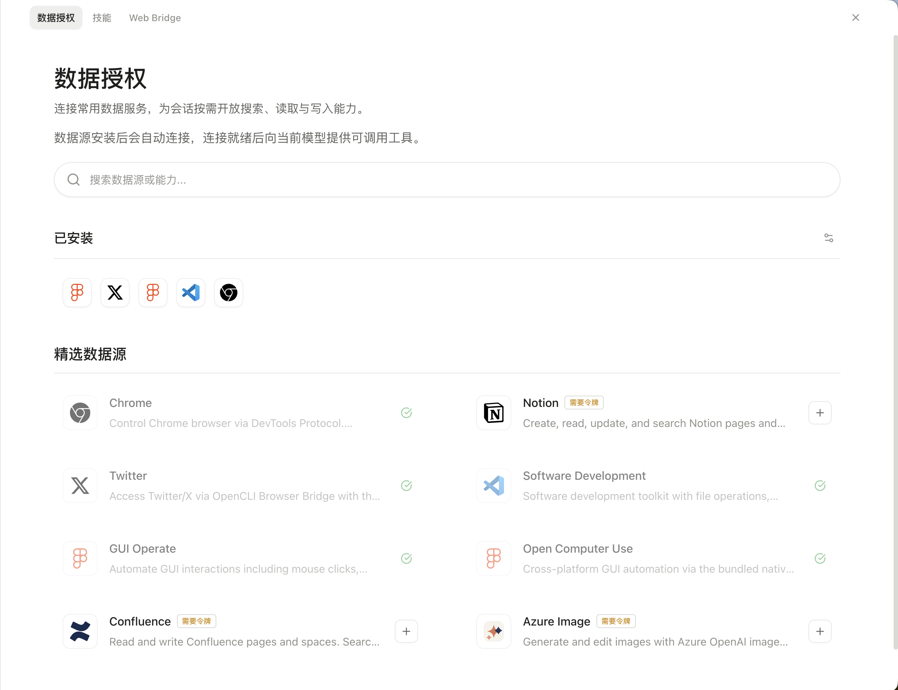
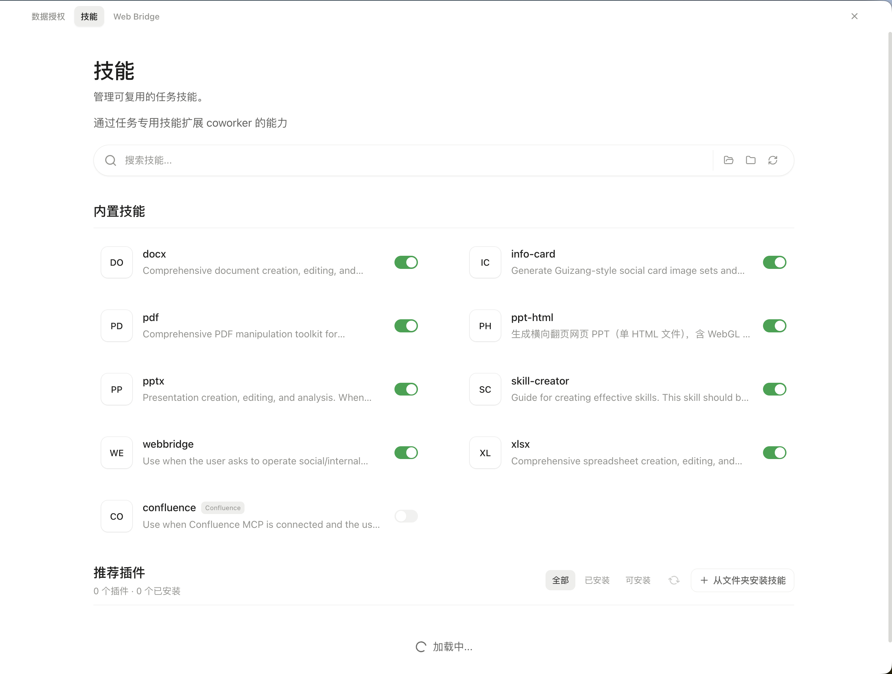
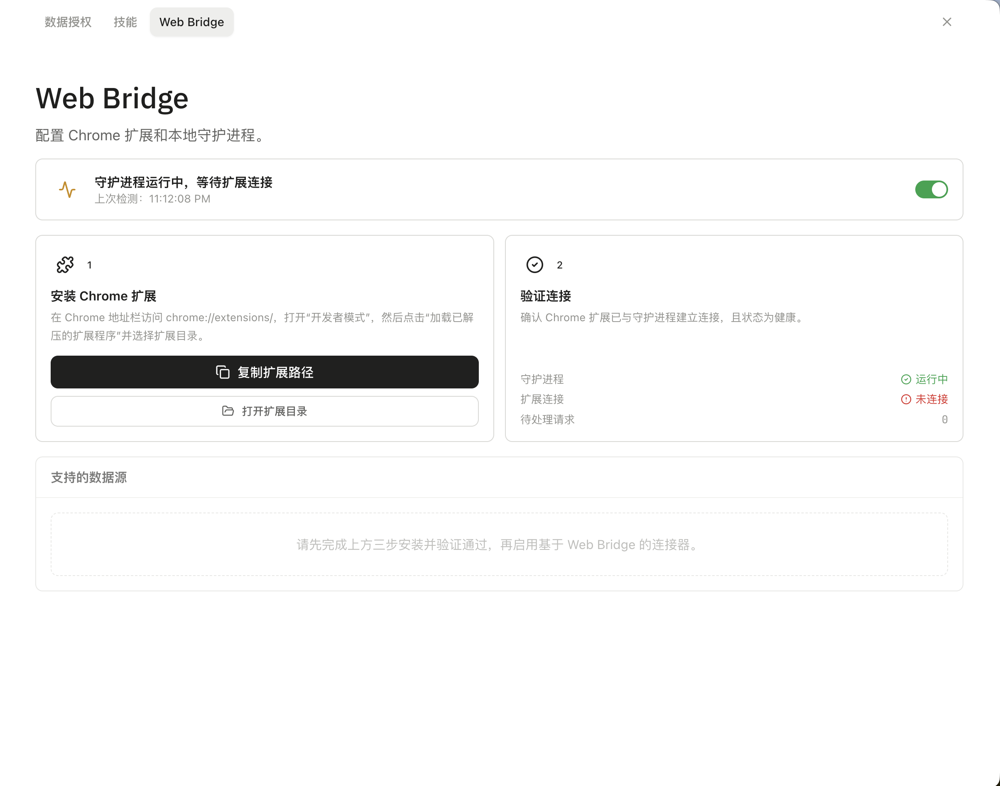

# AI Coworker Desktop

一个基于 Electron、React 和 TypeScript 构建的桌面端 AI 协作应用。项目将模型配置、会话任务、工具调用、MCP 服务、Skills、工作区记忆与定时任务统一到本地桌面工作台中，面向需要在指定工作区完成 AI 辅助任务的场景。

## 界面预览

### 软件主页面


### 插件中心

| 数据授权 | 技能管理 | Web Bridge |
| :---: | :---: | :---: |
|  |  |  |

## 核心能力

- **Agent 运行时**：基于 Pi coding-agent 创建会话，注入受控的文件与命令工具，流式回传消息、工具调用和执行轨迹。
- **模型与会话管理**：支持本地配置模型服务与运行参数，持久化会话状态，并支持取消、重试和工具调用循环保护。
- **MCP 与 Skills**：管理 MCP Server 配置、连接状态和工具发现，支持 `stdio`、SSE、Streamable HTTP 等连接方式；支持内置、全局和项目级 Skills 的启用与管理。
- **工作区记忆**：提供可开关的工作区记忆能力，支持检索、查看、重建和清理相关记忆数据。
- **定时任务**：支持一次性、按日、按周和按间隔执行的任务配置与状态管理。
- **桌面端安全边界**：Electron 渲染进程使用隔离上下文和沙盒；文件操作受工作区路径约束，工具调用支持允许、询问和拒绝规则。

## 项目结构

核心代码集中在 `src/`，其中 `src/main/agent/` 是 Agent 能力的核心实现。

```text
ai-coworker-desktop/
├── src/                              # 核心源码
│   ├── main/
│   │   ├── agent/                    # ★ 核心：Pi Agent 会话、模型解析与工具编排
│   │   │   ├── agent-runner.ts       # Agent 执行与工具循环
│   │   │   ├── pi-runtime.ts         # Pi 会话创建
│   │   │   └── web-tools/            # Web 搜索与抓取
│   │   ├── session/                  # 会话管理
│   │   ├── mcp/                      # MCP 服务与连接器
│   │   ├── skills/                   # Skills 加载
│   │   ├── memory/                   # 工作区记忆
│   │   ├── tools/                    # 工具执行
│   │   └── sandbox/                  # 权限与沙盒
│   ├── renderer/                     # React 界面
│   ├── preload/                      # IPC 桥接
│   ├── shared/                       # 共享类型
│   └── tests/                        # 测试
├── resources/                        # 应用资源
├── scripts/                          # 开发脚本
├── docs/                             # 项目文档
└── package.json
```

## 开发

### 环境要求

- Node.js 22
- npm
- macOS、Windows 或 Linux 开发环境

### 安装与启动

```bash
npm install
npm run dev
```

### 验证

```bash
npm run typecheck
npm test -- --run
npm run lint
```

### 构建

```bash
npm run build
```

项目包含 macOS、Windows 和 Linux 的打包配置；实际构建结果取决于当前系统、原生依赖和签名环境。

## 常用命令

| 命令 | 说明 |
| --- | --- |
| `npm run dev` | 启动 Electron/Vite 开发环境 |
| `npm run typecheck` | 执行 TypeScript 类型检查 |
| `npm test -- --run` | 单次运行 Vitest 测试 |
| `npm run lint` | 执行 ESLint 检查 |
| `npm run build:mcp` | 打包内置 MCP 资源 |
| `npm run build` | 构建桌面应用 |
| `npm run clean` | 清理构建产物 |
